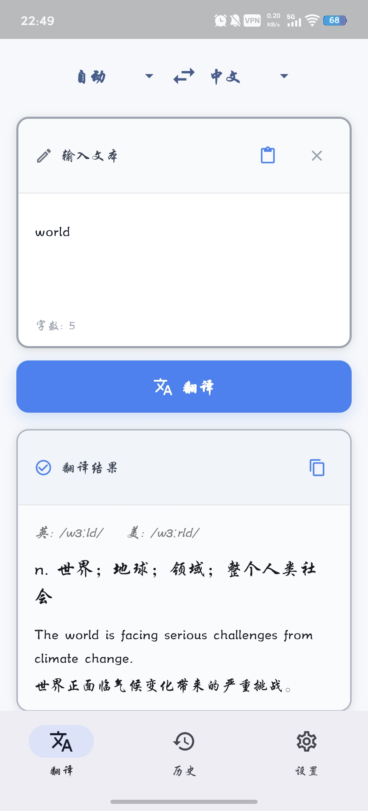
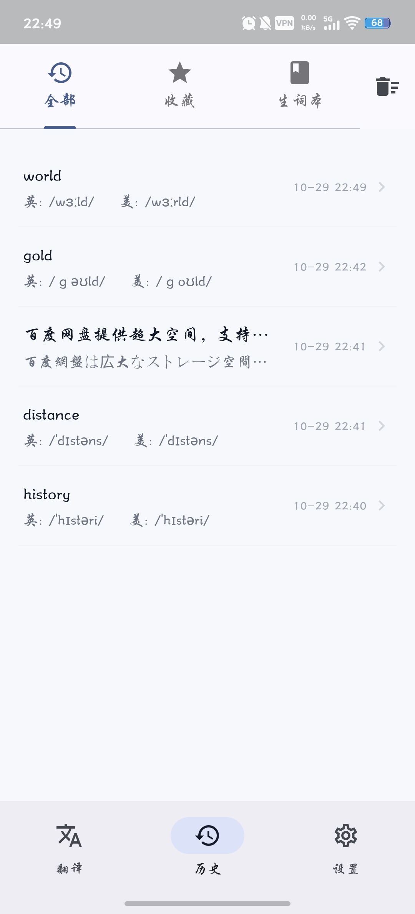
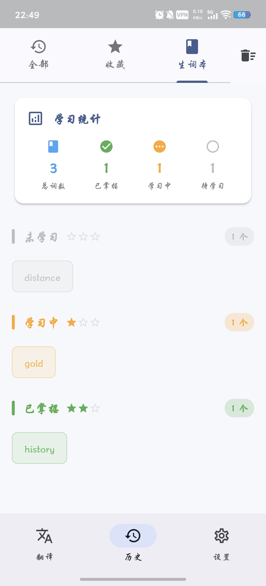

<div align="center">
  

  # Mini Translate

  ### 🌐 一个简洁优雅的 AI 翻译应用

  [](https://www.gnu.org/licenses/gpl-3.0)
  [](https://flutter.dev)
  [](https://www.android.com)
  [](https://github.com/foraeu/mini_translate/releases)

  **简体中文** | [English](README_EN.md)

  基于 Flutter 开发的安卓平台翻译应用，支持 OpenAI 兼容 API，提供智能翻译、生词本管理、历史记录等功能
  
</div>

---

## ✨ 功能特性

### 🤖 智能翻译
- 🎯 **AI 驱动** - 接入 OpenAI 兼容 API，提供准确的翻译结果
- 🔍 **自动语言检测** - 智能识别源语言，无需手动选择
- 📖 **词典模式** - 英语单词自动显示音标、词性、释义和双语例句
- 🎨 **流畅动画** - 翻译结果淡入效果，提升用户体验

### 📚 生词本系统
- ⭐ **三级评分** - 未学习 / 学习中 / 已掌握
- 📊 **进度追踪** - 星级评分 + 进度条可视化
- 🎯 **智能分组** - 按熟练度等级自动分类
- 📈 **学习统计** - 实时追踪学习进度
- 🔊 **TTS 朗读** - 内置语音朗读功能，练习发音

### 📝 历史记录
- 🗂️ **三大分类** - 全部 / 收藏 / 生词本
- 🎴 **差异化展示** - 列表、卡片、网格多种布局
- ⚡ **即时操作** - 收藏、删除、重新翻译
- 💾 **本地存储** - 数据持久化，离线可用

### ⚙️ 灵活配置
- 🔑 **自定义 API** - 支持任何 OpenAI 兼容接口
- 🔒 **安全存储** - API 密钥加密保存
- 🎛️ **简洁设置** - 一键配置，即刻使用

---

## 📸 应用截图

<div align="center">
  
  
  
</div>

---

## 🚀 快速开始

### 下载安装

前往 [Releases](https://github.com/foraeu/mini_translate/releases) 页面下载最新版本的 APK 文件。

### 配置说明

首次运行需要配置 API：

1. 进入 **设置** 页面
2. 填写以下信息：
   - **API URL** - OpenAI 兼容的 API 地址
   - **API Key** - 您的 API 密钥
   - **模型名称** - 如 `gpt-3.5-turbo`
3. 点击 **保存配置**

> 💡 **提示**: 支持 OpenAI、Azure OpenAI、Claude、本地模型等所有兼容接口

---

## 🛠️ 开发指南

### 环境要求

- Flutter SDK >= 3.0.0
- Dart SDK >= 3.0.0
- Android Studio / VS Code

### 本地运行

```bash
# 克隆项目
git clone https://github.com/foraeu/mini_translate.git
cd mini_translate

# 安装依赖
flutter pub get

# 运行应用
flutter run
```

### 构建发布

```bash
# 构建所有架构的 APK
flutter build apk --release --split-per-abi

# 构建 AAB (Google Play)
flutter build appbundle --release
```

---

## 📦 技术栈

| 技术 | 说明 |
|------|------|
| **框架** | Flutter 3.24.0 |
| **语言** | Dart 3.0+ |
| **状态管理** | Provider 6.1.1 |
| **网络请求** | Dio 5.4.0 |
| **本地存储** | SharedPreferences + SecureStorage |
| **语音朗读** | FlutterTTS 4.0.2 |
| **日期处理** | intl 0.18.1 |

---

## 📂 项目结构

```
lib/
├── main.dart                           # 应用入口
├── models/                             # 数据模型
│   ├── api_config.dart
│   └── translation_history.dart
├── services/                           # 业务服务
│   ├── api_service.dart
│   └── storage_service.dart
├── providers/                          # 状态管理
│   ├── translation_provider.dart
│   └── config_provider.dart
├── screens/                            # 页面
│   ├── home_screen.dart
│   ├── history_screen.dart
│   └── settings_screen.dart
└── widgets/                            # 组件
    ├── language_selector.dart
    ├── translation_input.dart
    ├── translation_output.dart
    └── history/                        # 历史记录模块
        ├── history_list_item.dart
        ├── history_card.dart
        ├── history_detail_dialog.dart
        ├── mastery_indicator.dart
        ├── vocabulary_statistics.dart
        ├── vocabulary_word_chip.dart
        ├── vocabulary_mastery_group.dart
        └── word_detail_dialog.dart
```

### 架构设计

采用分层架构，职责清晰：

```
┌─────────────────────────────────────┐
│            UI Layer                 │  ← Screens & Widgets
├─────────────────────────────────────┤
│        State Management             │  ← Providers
├─────────────────────────────────────┤
│        Business Logic               │  ← Services
├─────────────────────────────────────┤
│         Data Models                 │  ← Models
└─────────────────────────────────────┘
```

---

## 🎨 设计理念

### UI/UX 原则

- ✨ **Material Design 3** - 现代化设计语言
- 🎨 **Tailwind Blue 主题** - #3B82F6 主色调
- 📱 **无 AppBar 设计** - 最大化内容空间
- 🌈 **层次分明** - 卡片阴影与背景色区分
- 💫 **流畅动画** - 400ms 淡入淡出效果

### 色彩系统

| 颜色 | 用途 |
|------|------|
| `#3B82F6` | 主色调 - 按钮、图标、强调 |
| `#F6F8FB` | 背景色 - 页面底色 |
| `#FFFFFF` | 卡片色 - 内容区域 |
| `#F9FAFB` | 次级背景 - 标题栏 |
| `#6B7280` | 次要文本 - 辅助信息 |

---

## 🔄 更新日志

### v0.0.2 (2025-01-29)

**新增功能**
- 🔊 生词本 TTS 朗读功能
- 📊 历史详情对话框滚动支持

**界面优化**
- ✨ 输入输出框双层阴影，增强立体感
- 🎨 标题栏浅色背景，区分主体内容
- 🖊️ 输入框边框加深，提升视觉辨识度
- 📝 自动清理翻译文本多余空行

**Bug 修复**
- 🐛 修复详情对话框长文本无法滚动问题
- 🔧 修复 GitHub Actions 版本号读取问题

### v0.0.1 (2025-01-28)

- 🎉 首个版本发布
- 🌐 基础翻译功能
- 📚 生词本系统
- 📝 历史记录管理

[查看完整更新日志](CHANGELOG.md)

---

## 🤝 贡献指南

欢迎提交 Issue 和 Pull Request！

1. Fork 本仓库
2. 创建特性分支 (`git checkout -b feature/AmazingFeature`)
3. 提交更改 (`git commit -m 'Add some AmazingFeature'`)
4. 推送到分支 (`git push origin feature/AmazingFeature`)
5. 开启 Pull Request

---

## �� 开源协议

本项目基于 [GPL-3.0](LICENSE) 协议开源。

---

<div align="center">
  
  ### ⭐ 如果这个项目对你有帮助，请给一个 Star！

  Made with ❤️ by [foraeu](https://github.com/foraeu)
  
</div>
