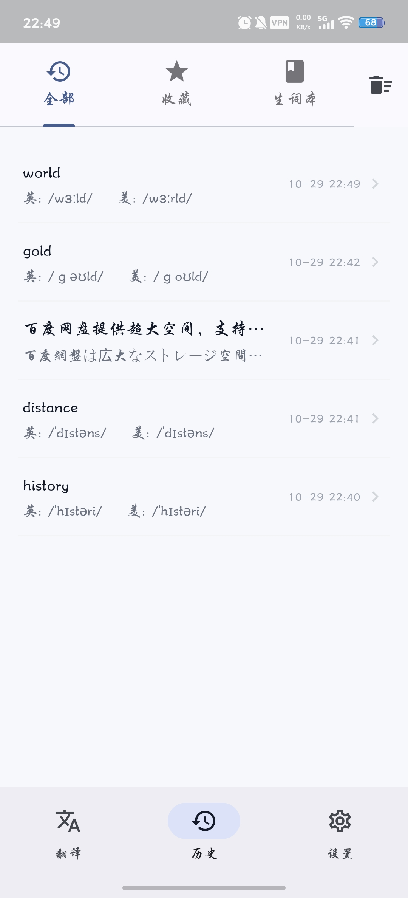
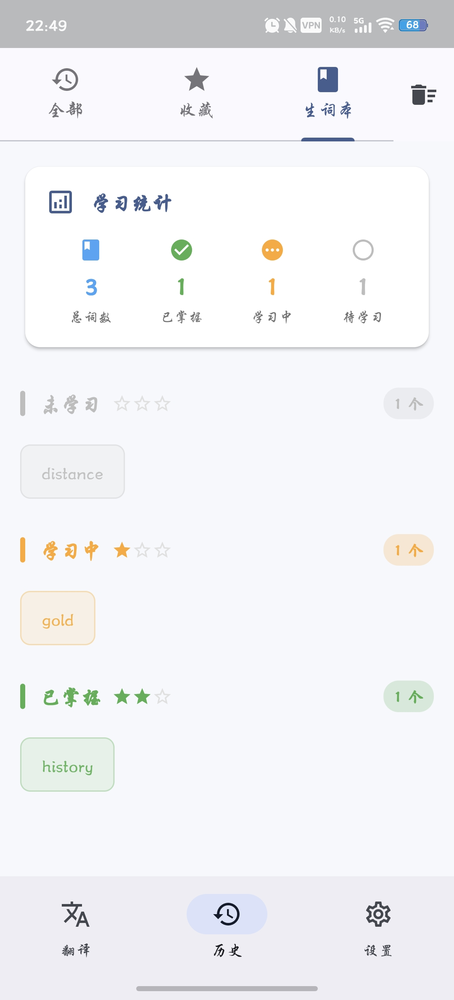

<div align="center">
  

  # Mini Translate

  ### 🌐 A Clean and Elegant AI Translation App

  [](https://www.gnu.org/licenses/gpl-3.0)
  [](https://flutter.dev)
  [](https://www.android.com)
  [](https://github.com/foraeu/mini_translate/releases)

  [简体中文](README.md) | **English**

  An Android translation app built with Flutter, supporting OpenAI-compatible APIs with intelligent translation, vocabulary management, and history tracking
  
</div>

---

## ✨ Features

### 🤖 Smart Translation
- 🎯 **AI-Powered** - Integrates with OpenAI-compatible APIs for accurate translations
- 🔍 **Auto Language Detection** - Intelligently identifies source language without manual selection
- 📖 **Dictionary Mode** - Automatically displays phonetics, parts of speech, definitions, and bilingual examples for English words
- 🎨 **Smooth Animations** - Fade-in effects for translation results enhance user experience

### 📚 Vocabulary System
- ⭐ **Three-Level Rating** - Not Started / Learning / Mastered
- 📊 **Progress Tracking** - Star ratings + progress bar visualization
- 🎯 **Smart Grouping** - Automatic categorization by proficiency level
- 📈 **Learning Statistics** - Real-time progress tracking
- 🔊 **TTS Playback** - Built-in text-to-speech for pronunciation practice

### 📝 History Management
- 🗂️ **Three Categories** - All / Favorites / Vocabulary
- 🎴 **Differentiated Display** - List, card, and grid layouts
- ⚡ **Quick Actions** - Favorite, delete, and re-translate
- 💾 **Local Storage** - Data persistence, works offline

### ⚙️ Flexible Configuration
- 🔑 **Custom API** - Support for any OpenAI-compatible interface
- 🔒 **Secure Storage** - Encrypted API key storage
- 🎛️ **Simple Settings** - One-click configuration, instant use

---

## 📸 Screenshots

<div align="center">
  
  
  
</div>

---

## 🚀 Quick Start

### Download & Install

Go to the [Releases](https://github.com/foraeu/mini_translate/releases) page to download the latest APK file.

### Configuration

Initial setup requires API configuration:

1. Go to **Settings** page
2. Fill in the following information:
   - **API URL** - OpenAI-compatible API endpoint
   - **API Key** - Your API key
   - **Model Name** - e.g., `gpt-3.5-turbo`
3. Click **Save Configuration**

> 💡 **Tip**: Supports OpenAI, Azure OpenAI, Claude, local models, and all compatible interfaces

---

## 🛠️ Development Guide

### Requirements

- Flutter SDK >= 3.0.0
- Dart SDK >= 3.0.0
- Android Studio / VS Code

### Local Setup

```bash
# Clone the repository
git clone https://github.com/foraeu/mini_translate.git
cd mini_translate

# Install dependencies
flutter pub get

# Run the app
flutter run
```

### Build Release

```bash
# Build APK for all architectures
flutter build apk --release --split-per-abi

# Build AAB for Google Play
flutter build appbundle --release
```

---

## 📦 Tech Stack

| Technology | Description |
|------------|-------------|
| **Framework** | Flutter 3.24.0 |
| **Language** | Dart 3.0+ |
| **State Management** | Provider 6.1.1 |
| **Networking** | Dio 5.4.0 |
| **Local Storage** | SharedPreferences + SecureStorage |
| **Text-to-Speech** | FlutterTTS 4.0.2 |
| **Date Handling** | intl 0.18.1 |

---

## 📂 Project Structure

```
lib/
├── main.dart                           # App entry point
├── models/                             # Data models
│   ├── api_config.dart
│   └── translation_history.dart
├── services/                           # Business services
│   ├── api_service.dart
│   └── storage_service.dart
├── providers/                          # State management
│   ├── translation_provider.dart
│   └── config_provider.dart
├── screens/                            # Pages
│   ├── home_screen.dart
│   ├── history_screen.dart
│   └── settings_screen.dart
└── widgets/                            # Components
    ├── language_selector.dart
    ├── translation_input.dart
    ├── translation_output.dart
    └── history/                        # History module
        ├── history_list_item.dart
        ├── history_card.dart
        ├── history_detail_dialog.dart
        ├── mastery_indicator.dart
        ├── vocabulary_statistics.dart
        ├── vocabulary_word_chip.dart
        ├── vocabulary_mastery_group.dart
        └── word_detail_dialog.dart
```

### Architecture

Clean layered architecture with clear responsibilities:

```
┌─────────────────────────────────────┐
│            UI Layer                 │  ← Screens & Widgets
├─────────────────────────────────────┤
│        State Management             │  ← Providers
├─────────────────────────────────────┤
│        Business Logic               │  ← Services
├─────────────────────────────────────┤
│         Data Models                 │  ← Models
└─────────────────────────────────────┘
```

---

## 🎨 Design Philosophy

### UI/UX Principles

- ✨ **Material Design 3** - Modern design language
- 🎨 **Tailwind Blue Theme** - #3B82F6 primary color
- 📱 **No AppBar Design** - Maximizes content space
- 🌈 **Clear Hierarchy** - Card shadows and background color differentiation
- 💫 **Smooth Animations** - 400ms fade-in/out effects

### Color System

| Color | Usage |
|-------|-------|
| `#3B82F6` | Primary - Buttons, icons, emphasis |
| `#F6F8FB` | Background - Page background |
| `#FFFFFF` | Card - Content areas |
| `#F9FAFB` | Secondary BG - Title bars |
| `#6B7280` | Secondary Text - Helper info |

---

## 🔄 Changelog

### v0.0.2 (2025-01-29)

**New Features**
- 🔊 TTS playback for vocabulary
- 📊 Scrollable history detail dialog

**UI Improvements**
- ✨ Dual-layer shadows for input/output boxes, enhanced depth
- 🎨 Light background for title bars, better content separation
- 🖊️ Darker input borders for better visibility
- 📝 Auto-cleanup of extra blank lines in translations

**Bug Fixes**
- 🐛 Fixed scrolling issue in detail dialog with long text
- 🔧 Fixed GitHub Actions version number reading

### v0.0.1 (2025-01-28)

- 🎉 Initial release
- 🌐 Basic translation features
- 📚 Vocabulary system
- 📝 History management

[View Full Changelog](CHANGELOG.md)

---

## 🤝 Contributing

Issues and Pull Requests are welcome!

1. Fork this repository
2. Create your feature branch (`git checkout -b feature/AmazingFeature`)
3. Commit your changes (`git commit -m 'Add some AmazingFeature'`)
4. Push to the branch (`git push origin feature/AmazingFeature`)
5. Open a Pull Request

---

## 📄 License

This project is licensed under the [GPL-3.0](LICENSE) License.

---

## 🙏 Acknowledgments

- [Flutter](https://flutter.dev) - Excellent cross-platform framework
- [OpenAI](https://openai.com) - Powerful AI capabilities
- [Pot](https://pot-app.com) - UI design inspiration

---

<div align="center">
  
  ### ⭐ If this project helps you, please give it a Star!

  Made with ❤️ by [foraeu](https://github.com/foraeu)
  
</div>
